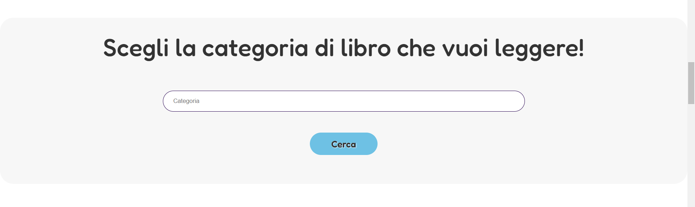
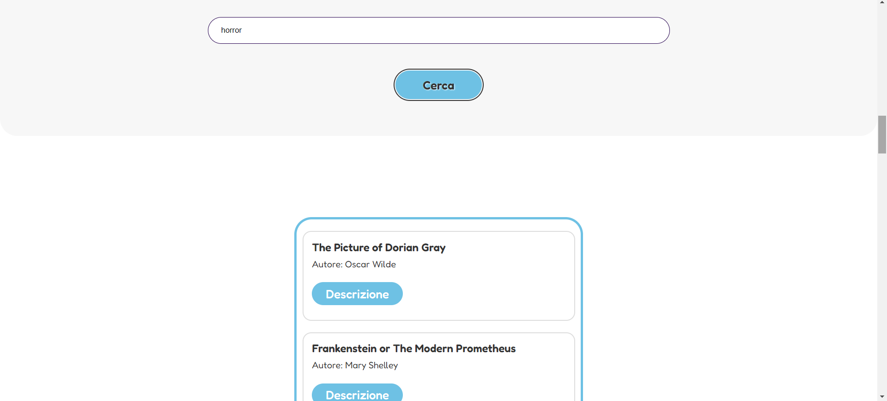
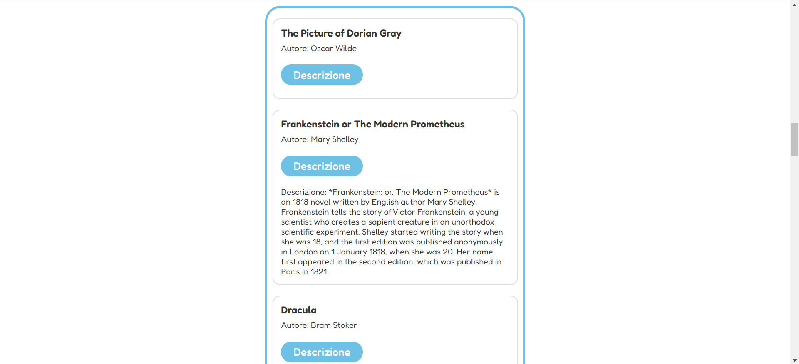

# Owly

Owly è una piattaforma educativa interattiva che aiuta bambini, genitori e insegnanti nell'apprendimento. La pagina web offre diverse sezioni per esplorare contenuti didattici, giocare con giochi educativi e accedere a risorse multimediali.

## ❓ Come funziona

All'apertura, verrà visualizzata la homepage. La pagina è suddivisa in varie sezioni, ognuna con una funzionalità specifica:

- **Sezione di ricerca libri:** una casella di ricerca per inserire il nome di una categoria di libri da leggere.
- **Sezione di studio:** una serie di card che offrono giochi educativi e approfondimenti.
- **Sezione LIS:** contenuti multimediali dedicati alla Lingua dei Segni Italiana.
- **Area personale:** dove gli utenti possono registrarsi e ricevere comunicazioni dalla scuola.


## 📷 Anteprima

**Sezione di ricerca libri**  
  

**Ricerca libri in esecuzione**  
  

**Approfondimento di un libro**  
  


## 📌 Come utilizzare

1. Scarica il progetto:
Vai sulla pagina GitHub del progetto e clicca su Code > Download ZIP, oppure clona il repository con Git

2. Estrai il contenuto del file ZIP scaricato e apri la cartella  **"website"**.

3. Apri il file **"index.html"**:
Fai doppio clic su  **"index.html"** per visualizzare la pagina nel tuo browser.


## 🛠️ Tecnologie utilizzate

- HTML5
- CSS3
- JavaScript
- [Axios](https://axios-http.com/): per gestire le richieste HTTP.
- [Lodash](https://lodash.com/): per semplificare operazioni su array e oggetti.


## 🧩 Struttura del progetto 


```
Progetto JavaScriptAdvanced di Chiara Barletta/
│
├── website/
│   ├── index.html
│   ├── index.js
│   ├── .gitignore
│   ├── package.json
│   ├── package-lock.json
│   ├── webpack.config.js
│   ├── README.md
│   └── assets/
│       ├── css/
│       │   └── style.css
│       ├── img/
│       │   └── [immagini]
│       └── js/
│           └── app.js
├── dist/
│   └── bundle.js
└── node_modules/
``` 

## 👩🏻‍💻 Autrice

Chiara Barletta


## 🌐 Demo Online

[Prova il progetto qui](https://neon-semifreddo-85a15c.netlify.app/). 


## 📂 Repository GitHub

Visita il codice sorgente su [GitHub](https://github.com/junior5969/website).


## 📄 Documentazione 

[Presentazione del progetto (PDF)](./Presentazione.pdf) 